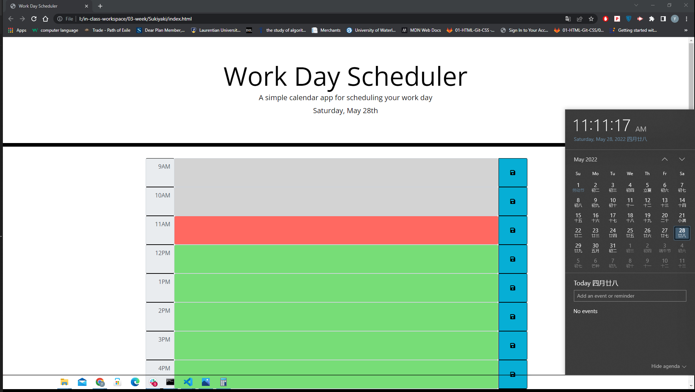
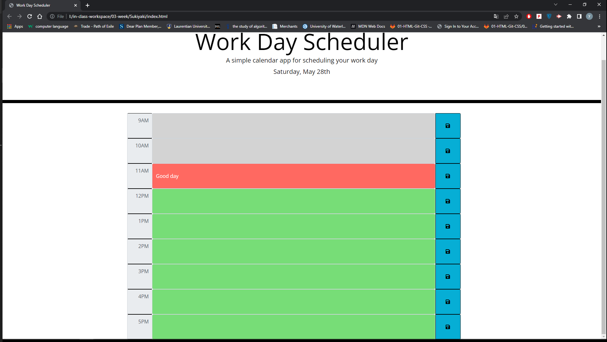
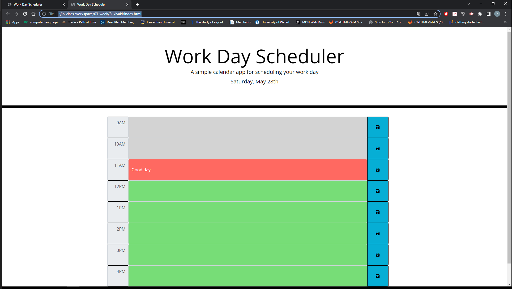

# 05 Third-Party APIs: Work Day Scheduler

## Main job

Create a simple calendar application that allows a user to save events for each hour of the day by modifying starter code. This app will run in the browser and feature dynamically updated HTML and CSS powered by jQuery.

## What I did

I used bootstrap input group to set up calendar. setInputGroup() function is used to build the main layout of the canlendar.
I used $(".btn").on() to save the input text to the local storage.
function loadText() is used to load text from loacl storage so that when user refresh the page. The saved text will still be showing on the page.

https://midnightwxd.github.io/Sukiyaki/
